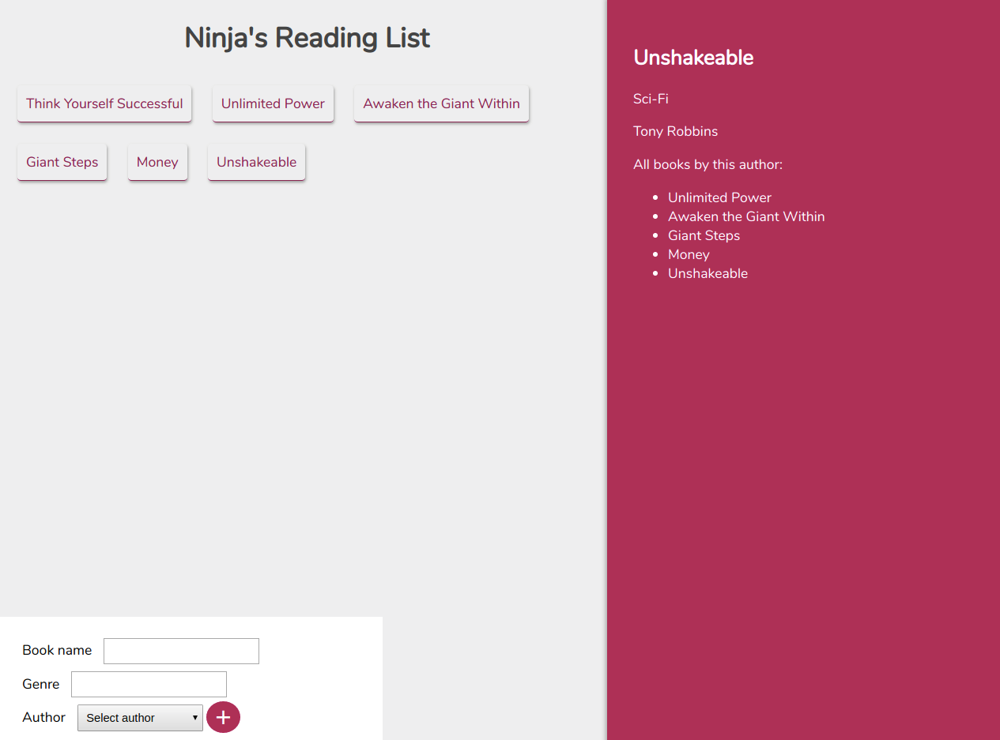

# GraphQL Basic Stuff

A practical small project in order to i increase my backend implement skills using GraphQL besides Express and MongoDB.



Application using Express as backend frameWork and running on Node runtime environment
it's also using React library on the front end, no SQL MongoDB ,GraphQL and ApolloClient in order to store data and communicate between data base an front end find all tools on BuiltWith section. Primary target was using a single end point "_/graphql_"to manage REST API instead of have several urls; and it's actually andled by Graph Query Language provided by GraphQL team and for communication
implement using Apollo Client packages such as apollo-boost and react-apollo.

# Getting Started

### These instructions will get you a copy of the project up and running on your local machine for development and testing purposes:

Primary exception of sharing this is repository is your attention on notes I'm attached on the following of this passage:

## Prerequisites

clone the source code using git or download it using top right link

## Installing

run following command on project root in order to installing dependencies and dev-dependencies

> npm install

## Built With

ClientSide

- apollo-boost
- axios
- graphql
- react,
- react-apollo
- react-dom
- react-scripts

ServerSide

- axios
- cors
- express
- express-graphql
- graphql
- json-server
- lodash
- mongoose
- winston

note : A few of mentioned libraries just using for development purposes and from removed from final source codes.

## Author

- Pouria Tajdivand

## License

This project is licensed under the MIT License - see the LICENSE.md file for details

## Notes

## Section One (On The GraphQL)

```javascript
1. What is GraphQL

  RESTful Routing high relation data issues:
  -url schema getting tough when we started have heavily nested relations
  -too many http request to getting data that we really need
  -over fetching data

  // Graph in GraphQl is a data structure of nodes and relations between its

  eg.
  // Query we write to go from a user to friend's company's names in GraphQL
    query{
      user(id:"23"){
        friends{
          company{
            name
          }
        }
      }
    }

2. Registering GraphQL with Express

    //GraphQL is registered to be tiny piece of overall express application not whole of it: (install graphql express-graphql)

    app.use('/graphql',expressGraphQl({
      graphiql: true // graphiql is a development tool allows us to make query against early server
    }))

3. GraphQL schema
    //the entire purpose of schema file is to instruct GraphQL what's type of data we have in our application

    eg.
    ./schema/schema.js

    const graphql = require('graphql')
    const {GraphQLObjectType, GraphQLString, GraphQLInt, GraphQLID} = graphql

    const UserType = new GraphQLObjectType({
      name: 'User',
      fields:()=>({   //wrapped fields into a function cuz this function will execute when all file run
        id: {type: GraphQLID},
        firstName: {type: GraphQLString},
        age: {type: GraphQLInt}
      })
    })

4. GraphQL RootQuery

    // allows graphQL to enter into our application data graph

    const { GraphQLSchema } = graphql

    const RootQuery = new GraphQLObjectType({
      name: 'RootQueryType',
      fields:{
        user:{
        type: UserType,
        args: {id: {type: GraphQLID} },
        resolve(parent, args){  //resolve function is used for return a piece of data from our dataStore
          return _.find(users,{id: args.id}) //return a rew javaScript Object
        }
        }
      }
    })

    module.exports = new GraphQLSchema({
      query: RootQuery
    })

    //server.js

    const schema = require('./schema/schema')

    app.use('/graphql',expressGraphQl({
      schema,
      graphiql: true
    }))

5. json-server //full fake REST API
    eg.
    // to watching a json dummy db run following command
    json-server --watch db.json

    db.json

    {
      "users": [
        { "id": "23", "name": "Bill", "age": "23", "companyId": "1" },
        { "id": "24", "name": "Steven", "age": "38", "companyId": "2" },
        { "id": "25", "name": "Pouria", "age": "22", "companyId": "2" }
      ],
      "companies": [
        { "id": "1", "name": "Apple", "description": "iPhone" },
        { "id": "2", "name": "Google", "description": "iPhone" }
      ]
    }

6.GraphQl Async Resolve functions using axios

  const RootQuery = new GraphQLObjectType({
    name:'RootQueryType',
    fields:{
      user:{
        type:UserType,
        args:{id:{type:GraphQLID}},
        resolve(parent, args){
          return axios.get(`http//localhost:3000/users/${args.id}`)
            .then(resp => resp.data) //cuz axios nested date into a data property
        }
      }
    }
  })

7. Type Relations

  const BookType = new GraphQLObjectType({
    name:'Book',
    fields:{
      id:{type:GraphQLID},
      authorId:{type:GraphQLID},
      author:{
        type:AuthorType,
        resolve(parent){
          return _.find(authors,{id:parent.authorId})
        }
      }
    }
  })

8. GraphQL List

const {GraphQLList} = require('graphql')

const AuthorType = new GraphQLObjectType({
  name:'Author',
  fields:()=>({
  id:{type: GraphQLID},
  books:{type:new GraphQLList(BookType),
    resolve(){
    return _.filter(books,{authorId:parent.id})
  }}
})})

9. More on RootQuery

const RootQuery = new GraphQLObjectType({
  name:'graphQLType',
  fields:{
    books:{
      type:new GraphQLList(BookType),
      resolve(){
        return books
      }
    }
}})

10 connecting to local db:

  mongoose.connect(
    'mongodb://localhost:27017/graphQL',
    { useNewUrlParser: true },
    err => {
      if (err) return winston.error(err.message, err);
    }
  );

  mongoose.connection.once('open', () => {
    winston.info('Connected to db.');
  });

11. Mutation //using for mutating date using graphQL(add,delete,update)

//GraphQL query:
  mutation{
    addAuthor(name:"Shaun", age:30){
      name
      age
    }
  }

const Mutation = new GraphQLObjectType({
  name:'Mutation',
  fields:{
    addAuthor:{
      type:AuthorType,
      args:{
        name:{type:GraphQLString},
        age:{type:GraphQLInt}
      },
      resolve(parent,args){
        let author = new Author({name:args.name, age:args.age})
        return author.save()
      }
    }
  }
})

module.exports = new GraphQLSchema({
  query:RootQuery,
  mutation: Mutation
})

12. GraphQL validating

const { GraphQLNonNull } = graphql  //prevent user set null property

const Mutation = new GraphQLObjectType({
  name: 'Mutation',
  fields:{
    addBook:{
      type: BookType,
      args:{name:{type:new GraphQLNonNull(GraphQLString)}},
      resolve(){//}
    }
  }
})

```

## Section Two (GraphQL Client)

```javascript
1. Apollo Setup

> npm i graphql apollo-boost react-apollo

**import ApolloClient from 'apollo-boost'
**import {ApolloProvider} from 'react-apollo'

const client = new ApolloClient({
  uri:'http://localhost:4000/graphql'
})

class App extends Components{
  render(){
    return(
      <ApolloProvider client={client}>
      <div>
      </div>
      </ApolloProvider>
    )
  }
}

2. Making Queries & Binding Data

import {gql} from 'graphql-boost'
import {graphql} from 'react-apollo'

const getBooksQuery = gql`
{
  books{
    name
    id
  }       //export queries from a external file using e.g. export{getBooksQuery}
}
`

//data object is available on this.props

export default graphql(getBooksQuery)(BooksLists)

// by default graphql deny accessing data it needed  to install and use third party library
//called cors in server side

const cors = require('cors')
app.use(cors())

2. data in this.props

  const { loading, books} = this.props.data  //till loading is true we books not available on data

  function displayBooks(){
    if(loading === true)return <p>loading...</p>
    return books.map(book => <li>{book.name}</li>)
}

3.React reacap

 preventDefault  -> e.g onSubmit(e){e.preventDefault()}

 change state by input value -> e.g onChange(e => this.setState{name: e.target.value})

  //a few html note!
  <form>
    <div>
      <label></label>
      <input type="text" />
    </div>

    <div>
      <select>
        <option>option 1</option>
      </select>
    </div>
  </form>

4.*** Mutation

  //mutation query example:

    const addBookMutation = gql`
      mutation($name:String!,genre:String!,authorId:ID!){        // ! this mark meaning nonNull
        addBook(name:$name,genre:$genre,authorId:$authorId){
          name
          genre
          id
        }
      }
    `

  compose // using to export multi graphql query

  import { compose,graphql } from 'apollo-boost'

  export default compose(
    graphql(getAuthorsQuery,{name:'gerAuthorsQuery'},
    graphql(addBookMutation,{name:'addBookMutation'})
    ))(AddBook)

  //*** this.props -> haven't data propery so much instead using name from compose

  //call and passing query variable to Mutation query example

  onSubmit(){
    this.props.addBookMutation({
      variables:{name: this.state.name, genre: this.state.genre}
    })
  }

5.refetchQueries

  e.g
      this.props.addBookMutation({
        variables:{},
        refetchQueries:[{query:getBooksQuery}]
      })

6. ordered query

  e.g
      const getBookQuery = gql`
        query($id:ID){
          book(id:$id){}
        }
      `
  //pass variables to an ordered query

  export default graphql(getBookQuery,{
    options:(props)=>{ //option function will execute whenever component props update
      return{
        variables:{
          id:props.bookId
        }
      }
    }
  })(BookDetails)
```
